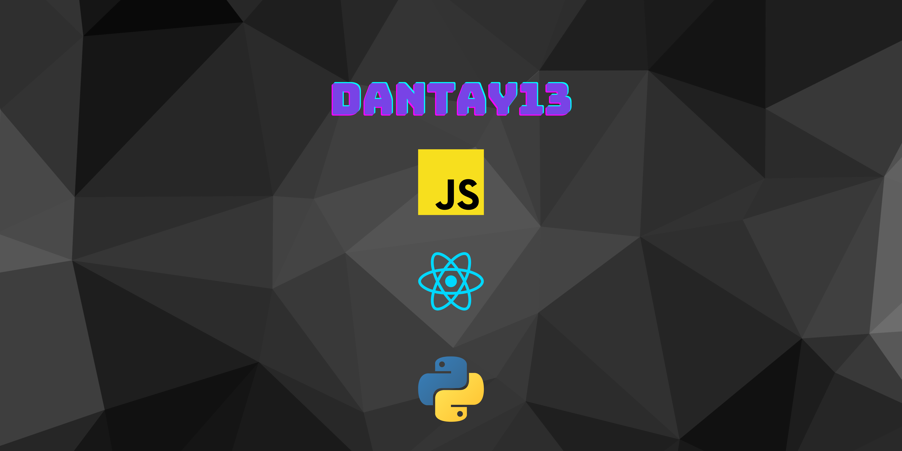

    

### Professional Competencies

- Growth Minset
    - I am good at adapting to any situation I encounter myself in.
    - I am a very curious person.
    - I am ambitious.
    - I take initiative in my work.

- Business Acumen
    - I am good at understanding a company's mission and vision statement.
    - Finding ways to wor fulfilling a company's objectives.

